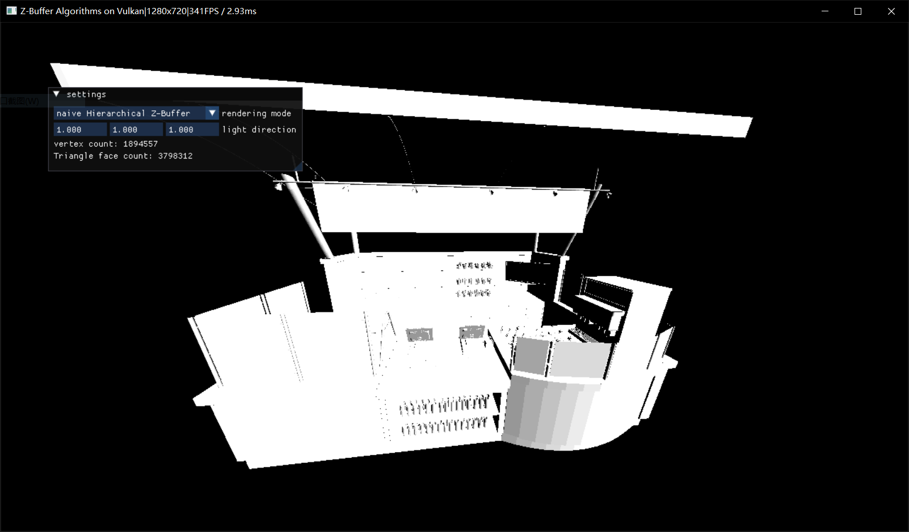

# CGHW_mid

2023《计算机图形学》秋学期大作业，此文档将一并作为程序文档和实验报告使用

## 程序功能概述

按照作业要求，本项目基于Vulkan实现了GPU加速的四种Z-Buffer算法：

- 普通Z-Buffer
- 扫描线Z-Buffer
- 层次Z-Buffer
- 八叉树加速的层次Z-Buffer（存在性能问题，不一定能运行起来）

简便起见，程序使用Lambert光照模型，并统一使用面法线来规避输入模型可能存在缺少顶点法线的问题

| 程序运行截图 ||
| --- | --- |
|  |

## 程序操作说明

可以与浮动小窗口交互，实现切换渲染模式、修改平行光方向的功能，并可查看当前模型的顶点个数和三角面个数，所见即所得

当焦点在窗口内时，可进行鼠标交互事件：

- 按下鼠标左键并拖动，可以绕着模型旋转
- 滑动鼠标滚轮，可以让视点向模型靠近/远离

由于事件原因，未实现动态重载模型的功能。若要切换模型，请将模型文件放置到resources/models文件夹下，并修改`ApplicationBaseRenderDetail.cpp`中`createRenderer()`函数的内容

## 编译环境及依赖说明

本项目使用`XMake`作为构建工具，对编译器的依赖较低。理论上只要支持C++20大部分功能的编译器都应该能通过编译。测试时，本项目所用编译器为`mingw-w64`下的`gcc 13`

本项目使用Vulkan作为图形API，并使用了一些高版本的特性。为次，请保证你的计算机完整地安装了最新版本的VulkanSDK，并搭载着一张至少支持`Vulkan 1.2`的显卡

由于本项目使用了`XMake`的包管理工具，因此无需手动配置依赖库，编译时会自动做好配置。唯一的例外是本项目使用的`rapidobj`库并不在`XMake`当前的远程依赖库中，因此以`submodule`的形式留存，在`git clone`时请注意

本项目所用第三方库及用途：

- VulkanSDK，用于图形渲染、调度GPU及编译shader
- imgui，用于窗口绘制和处理交互事件
- SDL2，作为imgui的跨平台backend来使用
- spdlog，用于打印日志
- glm，用于CPU上的代数运算
- rapidobj，用于加载`wavefront .obj`格式的模型文件

## 程序框架说明

本项目的底层使用了我正在写但只有个雏形的渲染器框架，所以看起来项目有一定规模。在此对程序框架做个简要的说明

`resources/`目录下按类排放了所有程序用到的资源。在预编译过程中，构建工具会调用`glsl`编译器把shader编译成`spv`中间码，然后把编译好的shader和其它资源一起更新到输出目录下

`engine/`目录下放的是引擎底层（后端）的实现，在本项目中是一个阉割特化的版本。有一些部分参考了已有的一些实现，已经在源文件中做好注释。具体来说包含以下部分：

- `asset/`：动态加载文件和模型资源的实现。项目借助`rapidobj`实现并行读取和剖分三角面的功能，在此基础上加入并行处理模型数据的功能（需要对读取数据重排，对模型后处理，并可能要与加载贴图等部分交互）
- `entity/`：一些实体`object`的实现，现在有对`AABB`和`Camera`的实现
- `renderer`：对渲染功能的高级抽象，本项目中仅包含`RenderContext`，实现初始化图形API、开启所需硬件特性、便捷创建`Buffer`和`Image`类资源的功能
- `RHI`：即`Rendering Hardware Interface`，本项目中仅包含对Vulkan API的部分简易封装，实现了分配内存管理、内存屏障辅助、基本资源管理和内存管理映射辅助、打印debug信息、创建pipeline辅助、硬件queue抽象、sampler管理的功能
- `utils`：一些杂项小功能，现在只抽象了一些`hash`的功能

`editor/`目录下放的是引擎顶层（前端）的实现，实际上作业的大部分实现都放在这里了。`editor.cpp`是整个程序的入口和事件框架，可以很清晰地看到程序的整个流程。`applicationBase.hpp`放了所有功能的声明，其实现分类在三个相关的源文件里，和渲染相关的最主要的部分在`***RenderDetail.cpp`里，想看渲染相关的部分直接看这个文件就好

## Z-Buffer实现算法说明

这部分来具体说明我是如何实现各个Z-Buffer算法的。相关的代码分散在各个shader中，其组织逻辑和渲染流程要到`***RenderDetail.cpp`里去看

### 普通Z-Buffer

本身没什么好说的，就是一边比较片元深度一边写入就可以了，相当于graphics pipeline里的`early_test`和`depth_test`的过程。不过，由于作业是不允许用`depth buffer`的，所以需要自己实现这个流程

这里的实现使用了一类较新的硬件特性`fragment shader pixel interlock`，顾名思义就是可以**在`fragment shader stage`里给需要的代码加一个`critical section`**，以此实现并行情况下对pixel的顺序访问。我们只要把深度比较和剔除的部分扔到这里面就可以了。需要注意的是，经过测试，我们依然需要**把NDC下的深度重构回`linear depth`才可以取得不错的精度，同时只有直接把片元丢弃(`discard`)才可以正常地工作**

### 扫描线Z-Buffer

传统意义上扫描线Z-Buffer是个软光栅化的过程，而且由于存在大量的非定量链表类数据结构对GPU很不友好，因此我花了很多时间做了一个适用并行且相对GPU-friendly的算法。流程是这样的：

1. 并行在每个triangle face上，对每个输入的triangle face做软光栅化，预先剔除掉背面、在视锥体外、不能覆盖至少一个pixel的那些面，并根据隐函数导数法则计算Screen空间下三角面的$\frac{dz}{dx}=-\frac{\bm n_x}{\bm n_z}$和$\frac{dz}{dy}=-\frac{\bm n_y}{\bm n_z}$；
2. 并行在每个triangle face上，处理三条边，记录每条边最靠上（y最小）的那个点、斜率的倒数和在y方向上的跨度。**为了不在扫描时重复处理某根扫描线，我们把三角面y方向上中间那个点所在的下面那条边的起始位置下移一个pixel**。进一步地，我们很容易发现三角面的**三条边肯定有一条跨过整个y方向的长边（如果存在$dy=0$的边就是两条），且剩下的短边存在明确的y方向顺序**，那么我们就可以对三条边做一个分类，让**塌缩边（$dy=0$）、短边、长边的下标分别存放**；
3. 并行在每个triangle face上，**自上而下**地扫描整个三角面，把每个y坐标上的扫描线扔到答案集合中。**由于做好了三条边的分类，我们可以直接以短边开始——长边结束的次序确定扫描线起止点，规避了对排序和链表的需求**，而且**可以提前确定扫描线的个数，只需每个面一次分配（atomic_add实现），提升了性能**
4. 并行在每个scanline上，顺着x坐标填充像素。**利用$dz$和三角面任意顶点的Screen空间位置，我们可以快速重构出面上每一点的深度**。需要注意的是，我们仍然需要Z-Buffer来比较深度，因为扫描线可能存在重叠部分，即我们仍然需要类似`pixel interlock`的结构，但`compute shader`中存在直接支持的特性。为次，我们申请一张**R32ui**格式的`image buffer`，借助**image CAS/Exchange operation**来实现逐pixel的`spinlock`

由于扫描线Z-Buffer的实现使用了`pixel spinlock`，可想而知对性能存在相当的影响。实际上更合理的方案是*把scanline按照y坐标分类，然后对每条线的最大深度做排序再倒序填充（画家算法）*。但考虑到作业要我们实现Z-Buffer上的算法而不是深度排序的算法，故没有做这种性能更优的实现

### 层次Z-Buffer

借助图形处理功能，我们很容易实现层次Z-Buffer。只需要先用普通Z-Buffer的方式写出一张最高精度的Z-Buffer，然后用`compute shader`去做逐级的mipmap操作（这里是**求一个Quad的最大深度**），最后并行地拿出每个三角面的包围盒、判断最小深度是否超过对应`mip level`上包围盒顶点的最大深度就可以了。需要说一下的是我们这里用到了两个现代图形API的特性：

1. **（伪）bindless descriptor**，也就是可以给一个descriptor binding slot固定个数的`multiple descriptors`，在shader里可以实现使用类似数组下标的形式索引对应binding上的所有资源。这一特性限制binding在一起的descriptors必须具有一致的资源类型，并提前知道个数。尽管存在限制，但很适合我们这里用来访问各级mipmap；

2. **indirect draw**，其作用是把CPU发出`drawcall`时需要确定的参数从CPU上移到GPU上，只需要驱动一个`indirect buffer`，而`indirect buffer`的具体内容可以由GPU确定。这一特性使得我们实现**GPU Driven Pipeline**，把处理数据的事情扔给GPU，从而大幅度减少`drawcall`。作为一个对**GPU Driven Culling**的实验，这里对层次Z-Buffer的实现最后会写出到一个`vertex buffer`，然后对`indirect buffer`填充顶点个数，实现简单的`indirect draw`

### 八叉树加速的层次Z-Buffer

我已经写好了八叉树加速的整个管线，并尽可能做了并行化的处理，然而还是会存在性能问题（讨论见`改进空间`），一跑起来就`DeviceLost`。这里说明一下我的做法，主要是八叉树构建的部分

类似于`2D mipmap`，其实我们可以申请`3D mipmap`，这样就可以把一个octree按层次编码进各级`image3D`资源里，而且索引和存储十分便捷。出于优化空间占用的目的，我们可以直接把最浅的几层扔掉，并人为确定一个最大深度。在构建octree时，我们可以并行在triangle face上，做完软光栅化之后**自上而下搜索一个层次，其grid的extent恰好可以覆盖三角面的AABB，而后就可以通过整除这个extent的方式直接确定应该插入的octree node**。同时，显而易见的我们可以**实时计算每一层次每个octree node的`center`和`extent`，故并不需要存储这些内容**，从而对GPU更加friendly

另外一个问题是如何存储每个octree node上的三角面，因为不定量的容器天然地不GPU-friendly，而且还会有竞争的问题。我的解决方案是存储一个总的`linked list buffer`，其中每个元素分别记录了`triangle index`和`prev pointer`。需要插入时，只需要**通过atomic_add分配新的linked node，并通过atomic_exchange更新octree node的header pointer，并让新的linked node的prev pointer指向octree node的原值即可**。这样一来，我们甚至**对每个octree node只需要存储一个R32ui格式的header pointer即可满足要求**，大幅度降低了内存需求

最后我们需要做个逐层次的遍历，每一层在X、Y方向上的grid都可以并行，每个线程只要从前到后地遍历该层次对应X、Y坐标的octree node即可，每步的处理和层次Z-Buffer是一样的，如果有`occluded`的情况可以直接退出遍历；同时，对每个通过深度测试的octree node，需要依次取出其存储的triangle face扔到答案`vertex buffer`里

## 程序性能测试

在我搭载了i7-9750H和GTX1660Ti的机器上，对三个不同面数模型的性能测试结果如下：

- 在较远视角下

|                    | bunny_1k | 6.837 logo | cafe_stall |
|:------------------:|:--------:|:----------:|:----------:|
|        面数        | 1000 | 13852 | 3798312 |
| wireframe(no cull) | 0.5~0.6ms | 0.6~0.7ms | ~4ms |
|    普通Z-Buffer    | 0.7~0.75ms | 0.75~0.8ms | ~2ms |
| 扫描线Z-Buffer | ~1ms | ~1.1ms | ~2.5ms |
| 层次Z-Buffer | ~1.2ms | ~1.2ms | ~2.75ms |

- 在较近视角下

|                    | bunny_1k | 6.837 logo | cafe_stall |
|:------------------:|:--------:|:----------:|:----------:|
|        面数        | 1000 | 13852 | 3798312 |
| wireframe(no cull) | ~0.6ms | 0.65~0.7ms | ~3.4ms |
|    普通Z-Buffer    | 0.6~0.7ms | 0.65~0.7ms | ~3.4ms |
| 扫描线Z-Buffer | ~1.2ms | ~1.4ms | ~7.3ms |
| 层次Z-Buffer | ~1ms | ~1.3ms | ~3.33ms |

由于层次Z-Buffer的实现是基于普通Z-Buffer的，所以一般情况下层次Z-Buffer性能要比其它两种Z-Buffer要差

从表格里可以看出，层次Z-Buffer相较扫描线Z-Buffer更适合模型面数大、模型投影面积大的情况。这是因为扫描线Z-Buffer最后填充的循环次数是取决于线长、即三角面投影面积的；而层次Z-Buffer只用估计三角面的包围盒，与三角形的面积关系不大，因此加速效果更好

可以估计八叉树加速能正常使用的话，其性能应该介于层次Z-Buffer到普通Z-Buffer，加速效果应该不会很显著，管理八叉树还非常麻烦。实际上，现在游戏业界的成熟做法基本只用层次Z-Buffer+帧间复用，很少加上八叉树，由此可见一斑

## 改进空间

由于这次作业是不允许使用硬件的Z-Buffer API，也就是在配置graphics pipeline时直接渲染一份depth buffer，因此我不得不使用了一些另类的方法来得到一张Z-Buffer，导致程序中充斥着大量的`pixel spinlock`，造成了相当的性能问题。如果直接改用depth buffer的话程序还要快很多

层次Z-Buffer中`Z-Pyramid`的构建还可以大幅度优化——由于每步处理时像素间的位置差很小，我们完全可以使用`group shared memory`和`wave intrinsics`技术来做优化。实际上Nvidia有个`vk-compute-mipmap`的sample，用了这两类技术来优化后生成`Z-Pyramid`的耗时基本可以压缩到0.2ms内

实际上关于扫描线Z-Buffer和层次Z-Buffer的实现不完全正确，主要是会有浮点数到整数、线性变换的精度问题，导致有些时候会出现闪烁、过度剔除的问题，这个还有得改

尽管我已经尽量把算法写成了并行友好的，但是八叉树加速的层次Z-Buffer的性能还是有问题。经过我的排查应该是出现在把每个`grid`对应的triangle linkedlist拿出来、把三角面加入vertex buffer的过程中，可想而知是循环次数过深的问题。但我暂时想不出有什么好的改进方案了。或许我们需要从根本上换用`LBVH`或者`SVO`才能一定程度上解决这个问题